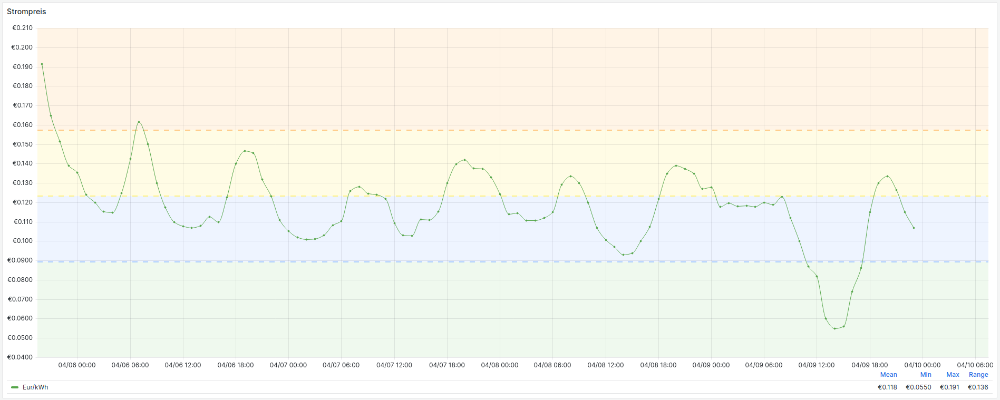
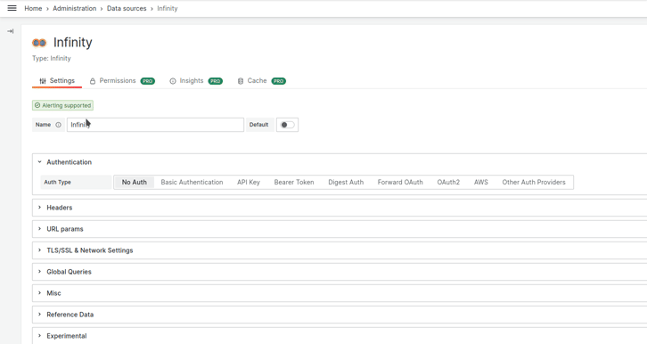
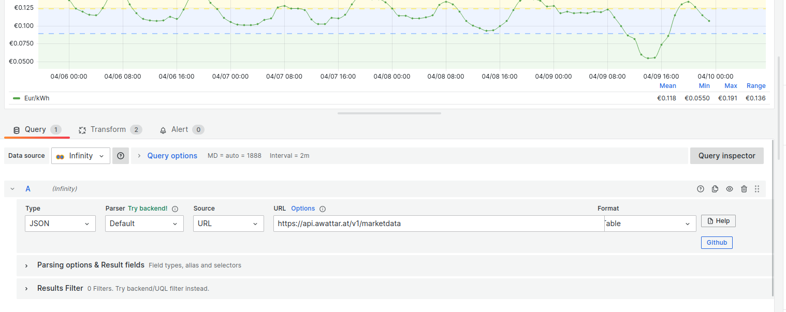

### Awattar Dashboard

* Requires the installed infinity datasource plugin into your grafana instance or grafana cloud.

Grafana Url --> https://grafana.com/grafana/dashboards/18465

---
You can use the default configuration of the infinity datasource.

---
The api url is configured in the dashboard item.

awattar api documentation => https://www.awattar.at/services/api/

---
Notes:

Tested with [Infinity](https://sriramajeyam.com/grafana-infinity-datasource/ "Infinity plugin/datasource")
 plugin/datasource version [1.3.0](https://github.com/yesoreyeram/grafana-infinity-datasource/releases/tag/v1.3.0)
