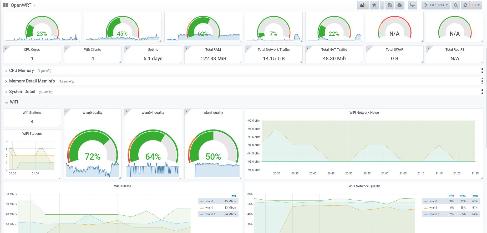

### OpenWRT Dashboard



Grafana Url --> https://grafana.com/grafana/dashboards/11147

HowTo --> https://www.cloudrocket.at/posts/monitor-openwrt-nodes-with-prometheus/

Prometheus source, for node_exporter

Monitor for OpenWRT routers

based on node exporter full

Only requires the default job_name: node, add as many targets as you need in '/etc/prometheus/prometheus.yml'.


```
  - job_name: OpenWRT
    static_configs:
      - targets: ['localhost:9100']
```

The following lua scripts has to be installen on yout openwrt router:

```
prometheus-node-exporter-lua
prometheus-node-exporter-lua-nat_traffic
prometheus-node-exporter-lua-netstat
prometheus-node-exporter-lua-openwrt
prometheus-node-exporter-lua-wifi
prometheus-node-exporter-lua-wifi_stations
```

To make the metrics accessible to other hosts than localhost edit `/etc/config/prometheus-node-exporter-lua` and change `localhost` to `lan`

```
config prometheus-node-exporter-lua 'main'
        option listen_interface 'lan'
        option listen_ipv6 '0'
        option listen_port '9100'
```

Restart via `/etc/init.d/prometheus-node-exporter-lua restart`. Now metrics can be viewed by http://<IP>:9100/metrics

Notes:

tested with prometheus-node-exporter-lua scripts version 2019.08.14-1


